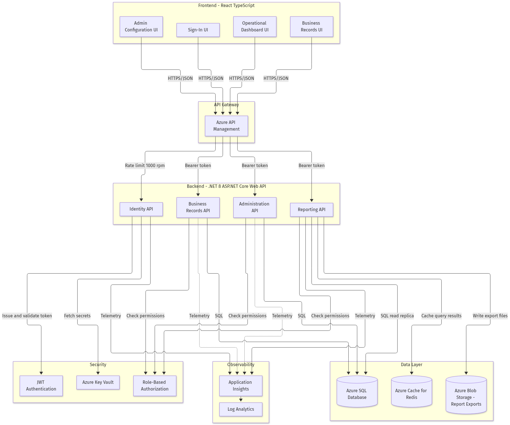
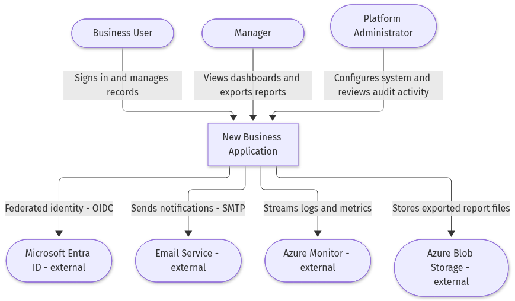
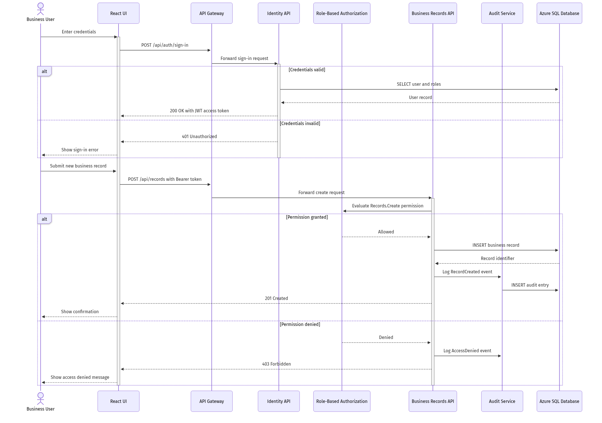
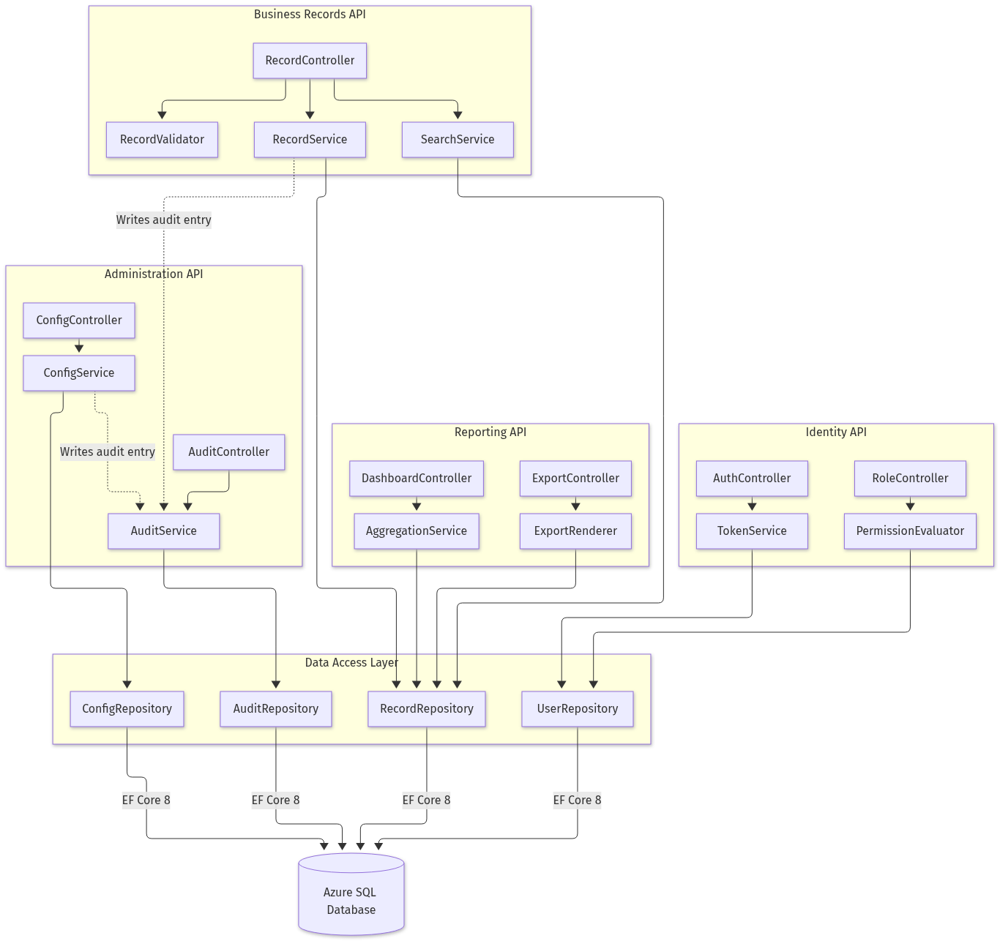

# **1. Introduction**

## **1.1 Purpose**

The New Business Application (Azure DevOps Epic 2862, project PSLGitHubCopilot) exists because business operations are currently fragmented across manual spreadsheets, shared mailboxes and disconnected tools, which makes record keeping inconsistent, access control informal and reporting unreliable. This System Design Document defines a single, secure, auditable web platform that lets authenticated users create and search business records, lets managers see operational dashboards and export reports, and lets platform administrators configure the system and review audit activity from one place.

**Business Impact & Key Decisions.** The platform consolidates four capability areas delivered as Features 2863 (User Access and Identity Management), 2866 (Business Process Management), 2869 (Reporting and Analytics) and 2872 (Platform Administration and Monitoring) into one layered application rather than four separate products. The key decision is a single React with TypeScript frontend served through Azure Front Door, a single .NET 8 ASP.NET Core Web API backend organised into four internal API modules, and a single Azure SQL Database as the system of record. This reduces operating cost, keeps one identity and authorisation model across all eleven User Stories (2864 through 2874), and gives one consistent audit trail. The alternative, a microservice per Feature, was rejected because the Epic has no stated independent-scaling or independent-release requirement, and the added distributed-transaction and observability cost is not justified at this scope (assumption, recorded in Section 7.1).

## **1.2 Scope**

- **Functional Scope**: User sign-in and role-based access (Stories 2864, 2865), creation and search/viewing of business records (Stories 2867, 2868), operational dashboard and report export (Stories 2870, 2871), and audit activity review and system configuration (Stories 2873, 2874).
- **Non-Functional Scope**: Transport Layer Security (TLS) 1.2 or higher on every endpoint, JSON Web Token (JWT) authentication, role-based authorization enforced server-side, Azure Key Vault for secrets, Transparent Data Encryption (TDE) at rest, immutable audit logging of security and data-change events, and a target of 99.9 percent monthly availability. Compliance alignment targets ISO 27001 Annex A access-control and logging controls and General Data Protection Regulation (GDPR) principles for personal data such as user email, display name and client IP address (assumption: no payment card or health data is in scope, therefore Payment Card Industry Data Security Standard (PCI DSS) and Health Insurance Portability and Accountability Act (HIPAA) controls are not applied).
- **In-Scope Integrations**: Microsoft Entra ID for federated OpenID Connect (OIDC) sign-in, Azure API Management as the gateway and rate-limiting layer, Azure SQL Database for relational persistence, Azure Cache for Redis for dashboard query caching, Azure Blob Storage for generated report export files, an SMTP email service for user notifications, and Application Insights with a Log Analytics workspace for telemetry.
- **Out-of-Scope Items**: Native iOS and Android mobile applications, offline or disconnected operation, bulk data migration from legacy spreadsheets, machine-learning or predictive analytics on business records, multi-tenant isolation for external customers, and public anonymous access of any kind. These are explicitly excluded because no Feature or User Story under Epic 2862 requests them.
- **Assumptions & Constraints**: The eleven work items under Epic 2862 currently carry titles only, with no descriptions or acceptance criteria populated in Azure DevOps. All field-level, threshold and volume detail in this document is therefore a defensible architectural assumption derived from the work-item titles plus the approved baseline technology stack, and every such assumption is listed in Section 7.1 for confirmation by the Business Analyst before build starts. Further constraints: the solution must deploy to an existing Azure subscription in the East US primary region with West US as the disaster-recovery region; the identity team owns the Entra ID application registration and must provision it before Sprint 1; and the platform team owns the Azure landing zone, so subnet and private-endpoint provisioning is a cross-team dependency.

## **1.3 Methodology**

Delivery follows a two-week-sprint Agile Scrum cadence inside the PSLGitHubCopilot Azure DevOps project, with the Epic → Feature → User Story hierarchy as the single requirements system of record and GitHub repository `sdlc-new-business-application` as the single engineering system of record. Design review is a two-stage gate: an architecture review board session at the end of the design sprint that signs off this document and the eight committed diagrams, and a per-story design walkthrough at sprint planning where the owning developer confirms the component boundaries in Section 3.1 before coding. Architecture Decision Records (ADRs) are stored as Markdown under `docs/architecture/epic-2862/` alongside the diagram sources, one file per decision, using the Context–Decision–Consequences format, and every significant deviation from this document must be raised as a new ADR and linked back to Epic 2862. Tooling used to produce this document comprises the Azure DevOps MCP connector for requirement retrieval, Mermaid for diagram authoring with Kroki-based server-side rendering to Portable Network Graphics (PNG), and the GitHub MCP connector for atomic commits so that diagram sources, rendered images and the document itself version together in one commit history.

# **2. System Architecture**

## **2.1 Software Architecture**

The logical view is a four-layer architecture. The presentation layer is a React 18 with TypeScript 5 single-page application hosted as an Azure Static Web App, containing four screen groups that map one-to-one onto the Features: the Sign-In UI, the Business Records UI, the Operational Dashboard UI and the Admin Configuration UI. All browser traffic terminates at Azure Front Door with a Web Application Firewall and is forwarded to Azure API Management, which is the single ingress for the backend and enforces request throttling at 1,000 requests per minute per subscription key, request-size limits and JWT signature pre-validation. The application layer is a .NET 8 ASP.NET Core Web API partitioned into four internal modules, the Identity API, the Business Records API, the Reporting API and the Administration API, each exposing versioned REST endpoints under `/api/v1/` that exchange JSON Data Transfer Objects (DTOs). Cross-cutting security services sit beside these modules: a TokenService that issues and validates JWT bearer tokens, a PermissionEvaluator that resolves a caller's effective permissions from their role assignments, and managed-identity access to Azure Key Vault so that no connection string or signing key is ever present in source or configuration files. The data layer is an Azure SQL Database accessed exclusively through Entity Framework Core 8 repositories over a private endpoint, with Azure Cache for Redis holding pre-aggregated dashboard projections at a 60-second time-to-live, and Azure Blob Storage holding generated export files behind time-limited shared access signatures. Observability is uniform: every module emits structured telemetry to Application Insights, which forwards into a Log Analytics workspace that holds correlated request, dependency, exception and custom audit traces. Protocols are deliberately narrow — HTTPS with JSON between browser, gateway and API; Tabular Data Stream (TDS) over a private endpoint between API and database; TLS to Redis and Blob Storage — which keeps the attack surface small and makes every hop individually auditable.

**Caption — Solution Architecture.** This diagram shows how a business user's request travels from one of the four React screens, through the Web Application Firewall and API Management gateway, into the matching backend API module, past the JWT authentication and role-based authorization checks, and finally to the Azure SQL Database, Redis cache or Blob Storage. Its business meaning is that no feature can reach data without first passing identity and permission enforcement, which is what makes the audit trail in Feature 2872 trustworthy and what allows the organisation to prove who touched which record.

**Caption — System Context.** This diagram places the New Business Application in its environment, showing the three human actor types the Epic implies — Business User, Manager and Platform Administrator — and the four external systems the platform depends on: Microsoft Entra ID for federated identity, the email service for notifications, Azure Monitor for operational telemetry and Azure Blob Storage for exported report files. Its business meaning is that the platform is not self-contained; three of the four external dependencies are owned by other teams, so their availability directly caps the platform's own service level.

**Fallback.** If the rendered images cannot be displayed, the Mermaid sources are committed and readable at `docs/architecture/epic-2862/diagram-architecture.mmd` and `docs/architecture/epic-2862/diagram-system-context.mmd`. In text form: four React screens send HTTPS JSON to one API Management gateway; the gateway routes to one of four .NET 8 API modules; every module consults JWT authentication and role-based authorization before touching data; the Identity API reads secrets from Key Vault by managed identity; the Records and Administration APIs read and write Azure SQL; the Reporting API reads a SQL replica, caches results in Redis and writes export files to Blob Storage; all four modules emit telemetry to Application Insights, which feeds Log Analytics.

# **3. Detailed Design**

## **3.1 Software Detailed Design**

The backend decomposes into controllers, services and repositories with no layer skipping permitted. The Identity API contains `AuthController` and `RoleController` over `TokenService` and `PermissionEvaluator`, backed by `UserRepository`; it implements Story 2864 by exposing `POST /api/v1/auth/sign-in`, which accepts a credential DTO, verifies the password hash using ASP.NET Core Identity's PBKDF2 implementation with a minimum of 100,000 iterations, and returns a signed JWT with a 60-minute access-token lifetime and a 7-day refresh token; it implements Story 2865 by resolving the caller's roles into a permission set and stamping those permissions as claims, with server-side re-evaluation on every request so that a revoked role takes effect immediately rather than at next sign-in. The Business Records API contains `RecordController` over `RecordValidator`, `RecordService` and `SearchService`, backed by `RecordRepository`; Story 2867 is served by `POST /api/v1/records`, which validates the payload with FluentValidation, assigns a human-readable `Reference` from a monotonic sequence, and persists the record; Story 2868 is served by `GET /api/v1/records` with filter, sort and keyword parameters, returning server-side paginated results capped at 100 items per page to protect the database. The Reporting API contains `DashboardController` and `ExportController` over `AggregationService` and `ExportRenderer`; Story 2870 is served by `GET /api/v1/dashboard/metrics`, which reads pre-aggregated counts from Redis and falls back to a read replica query on cache miss; Story 2871 is served by `POST /api/v1/reports/export`, which queues an asynchronous export, renders Comma-Separated Values (CSV) or Portable Document Format (PDF), writes it to Blob Storage and returns a time-limited download link. The Administration API contains `ConfigController` and `AuditController` over `ConfigService` and `AuditService`; Story 2874 exposes `GET` and `PUT /api/v1/configuration/{key}` with change reason capture, and Story 2873 exposes `GET /api/v1/audit/events` with date-range and actor filters over an append-only table.

Key algorithms and cross-cutting policies are specified as follows. Authorization uses a deny-by-default policy evaluation: `PermissionEvaluator` loads the caller's role-permission closure, and any endpoint without an explicit permission attribute is rejected at startup by a unit test that enumerates all controller actions. Error handling is centralised in a middleware that converts domain exceptions into RFC 7807 Problem Details responses, maps validation failures to HTTP 400, authorization failures to HTTP 403, missing entities to HTTP 404 and unhandled faults to HTTP 500 with a correlation identifier but never an internal stack trace. Idempotency is mandatory on all write endpoints: callers supply an `Idempotency-Key` header, the service stores the key with the resulting response for 24 hours, and a repeat of the same key returns the stored response rather than creating a duplicate record — this is what prevents double submission of a business record when a user double-clicks or a network retry fires. Retries follow an exponential backoff of 200 milliseconds, 400 milliseconds and 800 milliseconds with jitter for transient SQL and Blob Storage faults only, wrapped in a Polly circuit breaker that opens after five consecutive failures and half-opens after 30 seconds, so a struggling dependency degrades the platform instead of collapsing it. Caching uses a cache-aside pattern keyed by tenant-free composite keys such as `dashboard:metrics:{roleScope}:{dateBucket}` with a 60-second time-to-live, and invalidation is event-driven: every successful record create or status change publishes an internal domain event that evicts the matching dashboard keys, which keeps the dashboard in Story 2870 consistent with the records created in Story 2867 without waiting for natural expiry. Audit writing is non-negotiable and synchronous within the same database transaction as the business change, so a record creation and its audit event either both commit or both roll back, which is the control that makes Story 2873 defensible to an auditor.

**Caption — Critical Workflow Sequence.** This diagram traces the single highest-value flow end to end: a business user signs in, receives a JWT, submits a new business record, has their `Records.Create` permission evaluated, and either gets a 201 Created with an audit entry written or a 403 Forbidden with an access-denied event logged. Its business meaning is that both the success path and the refusal path leave evidence, so the organisation can answer "who created this" and "who tried and was blocked" from the same audit table.

**Caption — Component Diagram.** This diagram zooms inside the backend to show the four API modules, their controllers, services and the shared data-access repositories, including the dotted audit-write dependency from the record and configuration services into the Audit Service. Its business meaning is that administration and audit are not bolted on at the end; they are a dependency of the business logic itself, which prevents a developer from shipping a data-changing feature that silently bypasses the audit trail.

**Fallback.** The Mermaid sources are committed at `docs/architecture/epic-2862/diagram-sequence.mmd` and `docs/architecture/epic-2862/diagram-component.mmd`. In text form, the critical sequence is: User → React UI → API Gateway → Identity API → Azure SQL (credential check) → JWT returned; then User → React UI → API Gateway → Business Records API → Role-Based Authorization → Azure SQL (insert) → Audit Service → Azure SQL (audit insert) → 201 Created; the denial branch replaces the insert with an `AccessDenied` audit event and a 403 response.
