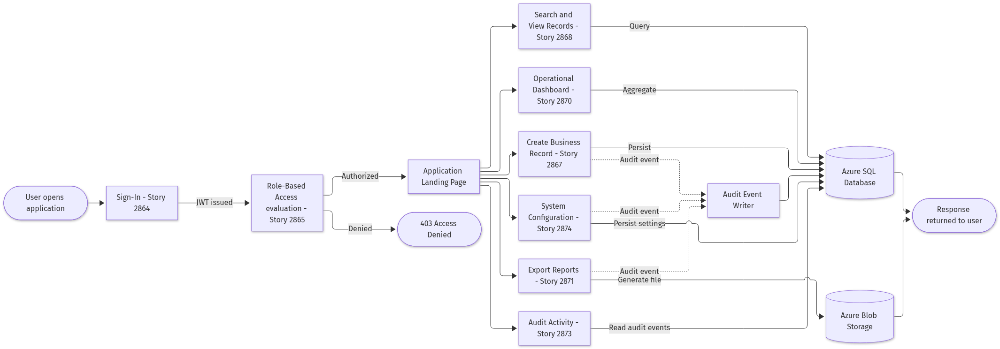
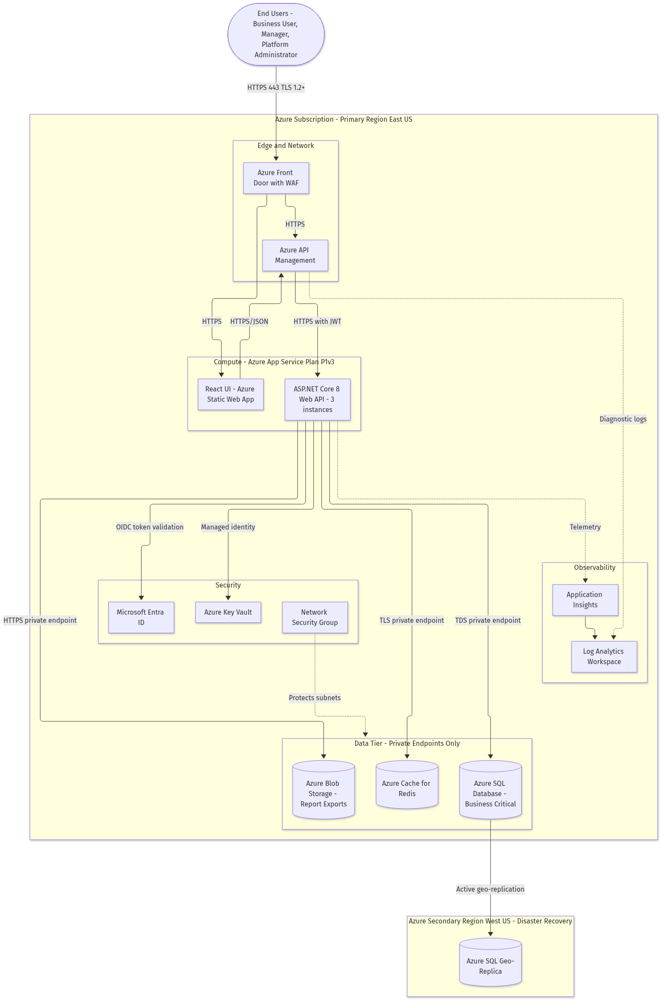
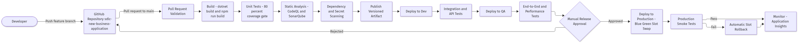
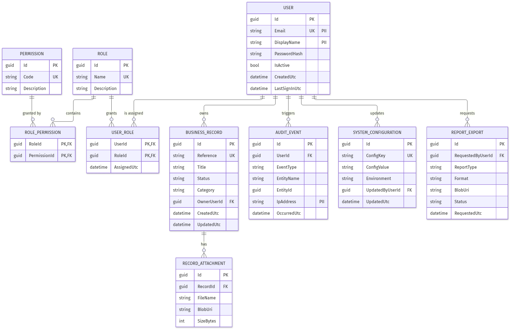

# **4. Technical Design Specification**

## **4.1 Integration Plan**

- **Microsoft Entra ID (OpenID Connect) — identity dependency for Story 2864.** The Identity API federates sign-in to Entra ID using the authorization-code flow with Proof Key for Code Exchange (PKCE), validating `iss`, `aud`, `exp` and `nbf` claims against the tenant's JSON Web Key Set, refreshed every 24 hours. The identity team owns the application registration and must deliver the client identifier and redirect Uniform Resource Identifiers (URIs) before Sprint 1; integration checkpoint is a successful end-to-end sign-in in the Dev environment by end of Week 4.
- **Azure API Management — gateway contract for all four Features.** Every backend route is published under `/api/v1/` with an OpenAPI 3.0 specification generated at build time from the .NET controllers and published as the versioned contract; breaking changes require a new `/api/v2/` path rather than a mutation of v1. Throttling is set at 1,000 requests per minute per subscription key and 20 requests per second per client IP address, with a 30-second backend timeout; the integration checkpoint is a published OpenAPI document with zero schema-validation errors.
- **Azure SQL Database — data contract for Stories 2867, 2868, 2873 and 2874.** Access is exclusively through Entity Framework Core 8 repositories over a private endpoint using Azure Active Directory managed-identity authentication, with no SQL login credentials issued to the application. Schema changes ship as versioned EF Core migrations reviewed in the same pull request as the code; the integration checkpoint is a migration that applies cleanly to an empty database and to a seeded database in the same pipeline run.
- **Azure Blob Storage and SMTP email service — asynchronous event flows for Story 2871.** Report export is an event flow: `ExportController` enqueues a request, `ExportRenderer` writes the CSV or PDF artifact to the `report-exports` container, and the platform emails the requester a shared-access-signature link valid for 60 minutes. Authentication to storage is managed identity with the Storage Blob Data Contributor role; the integration checkpoint is a 50,000-row export completing and delivering a working link within 5 minutes.
- **Application Insights and Log Analytics — telemetry contract for Feature 2872.** All four API modules and the API Management instance emit correlated telemetry using a shared `operation_Id`, so one user action is traceable across gateway, API, database and cache in a single query. Custom audit events are emitted with the dimensions `EventType`, `EntityName`, `EntityId` and `ActorUserId`; the integration checkpoint is an end-to-end trace query in Log Analytics returning every hop of a single record-creation request.

## **4.2 Configuration Checklist**

- **Azure resource names and SKUs (owner: Platform Engineering).** Provision `rg-nba-prod-eastus` containing `app-nba-api-prod` on an Azure App Service Plan P1v3 with 3 instances, `stapp-nba-ui-prod` as the Static Web App, `sql-nba-prod` hosting database `nba` on the Business Critical tier, `redis-nba-prod` on Standard C1, `stnbaexportsprod` for Blob Storage and `kv-nba-prod` for Key Vault. All names are fixed in Terraform variables so that environment promotion only changes the environment token.
- **Key Vault secret inventory (owner: Security Engineering).** Store `SqlConnectionString`, `JwtSigningKey`, `EntraClientSecret`, `SmtpPassword` and `RedisConnectionString` as Key Vault secrets referenced by App Service Key Vault references, never as plain application settings. Secret rotation is 90 days for application secrets and 180 days for the JWT signing key, with overlapping validity so rotation causes no sign-out storm.
- **Application configuration variables (owner: Development Team).** `Jwt:AccessTokenMinutes=60`, `Jwt:RefreshTokenDays=7`, `Records:MaxPageSize=100`, `Dashboard:CacheTtlSeconds=60`, `Export:MaxRows=50000`, `Export:SasMinutes=60`, `Audit:RetentionDays=2555` and `Resilience:MaxRetries=3`. Each value is environment-overridable but must be present in `appsettings.json` with these defaults so a missing override never silently disables a control.
- **Infrastructure-as-code state and modules (owner: Platform Engineering).** Terraform 1.7 with the `azurerm` provider pinned at version 3.x, remote state in an Azure Storage backend with state locking enabled, and one module per tier (`network`, `compute`, `data`, `security`, `observability`). No manual portal change is permitted in QA or Production; drift detection runs nightly and raises a work item on any deviation.
- **Version-controlled deployment requirements (owner: DevOps).** .NET SDK 8.0.x, Node.js 20 LTS, EF Core 8 tooling and the Static Web Apps CLI are pinned in `global.json`, `.nvmrc` and the pipeline definition so local and pipeline builds are byte-comparable. Every deployable artifact is tagged `major.minor.patch+buildId` and the same artifact binary is promoted unchanged from Dev through QA to Production.

## **4.3 Service Level Agreement**

- **Availability target: 99.9 percent per calendar month** for the authenticated application surface, which permits at most 43 minutes 12 seconds of unplanned downtime per 30-day month. Availability is measured by a synthetic Application Insights availability test hitting `/api/v1/health` from three Azure regions every 5 minutes, and the Platform Engineering on-call rota owns the number.
- **Latency thresholds measured at the 95th percentile at the gateway**: sign-in (Story 2864) under 800 milliseconds, record create (Story 2867) under 500 milliseconds, record search (Story 2868) under 700 milliseconds for a page of 100 items, and dashboard load (Story 2870) under 1,000 milliseconds on a cache hit. Report export (Story 2871) is asynchronous and targets completion within 5 minutes for 50,000 rows.
- **Recovery objectives**: Recovery Time Objective (RTO) of 4 hours and Recovery Point Objective (RPO) of 15 minutes, delivered by Azure SQL active geo-replication from East US to West US plus point-in-time restore retained for 35 days. A documented failover drill is executed every 6 months and its evidence attached to Epic 2862.
- **Maintenance windows**: planned changes are deployed Sundays 02:00–05:00 UTC, announced at least 5 business days in advance, and executed as blue-green App Service slot swaps so that routine releases consume zero downtime budget. Emergency fixes bypass the window only with Change Advisory Board approval recorded in Azure DevOps.
- **Escalation and support SLAs**: Severity 1 (platform unavailable or data-integrity breach) acknowledged within 15 minutes and mitigated within 4 hours; Severity 2 (a Feature unusable, for example export failing) acknowledged within 1 hour and resolved within 1 business day; Severity 3 acknowledged within 1 business day and scheduled into the next sprint. Escalation path is on-call engineer, then Engineering Lead, then Service Owner at 2 hours of unresolved Severity 1.

## **4.4 Security & Compliance Architecture**

- **Network segmentation (owner: Security Engineering).** The application runs in a dedicated virtual network with three subnets — `snet-ingress` for Front Door and API Management, `snet-compute` for the App Service with virtual-network integration, and `snet-data` which accepts traffic only from `snet-compute`. Azure SQL, Redis and Blob Storage are reachable solely through private endpoints with public network access disabled, and Network Security Group rules default-deny all inbound traffic.
- **Encryption standards.** TLS 1.2 is the enforced minimum for every external and internal hop with TLS 1.3 preferred where supported; Azure SQL uses Transparent Data Encryption with Microsoft-managed keys, Blob Storage uses 256-bit Advanced Encryption Standard (AES-256) server-side encryption, and personally identifiable columns `USER.Email`, `USER.DisplayName` and `AUDIT_EVENT.IpAddress` carry a PII classification tag so that data-loss-prevention scanning and export redaction can act on them.
- **Key and credential management.** All application identities are Azure managed identities with no stored credentials; the JWT signing key lives in Key Vault with a 180-day rotation and dual-key overlap, application secrets rotate every 90 days, and Key Vault is configured with soft-delete and purge protection plus audit logging of every secret read. Any secret detected in source code fails the pipeline at the secret-scanning gate.
- **Compliance mappings.** Controls map to ISO 27001 Annex A.9 (access control) through deny-by-default role-based authorization in Story 2865, A.12.4 (logging and monitoring) through the immutable audit trail in Story 2873, and A.10 (cryptography) through the encryption standards above. GDPR alignment covers lawful processing, a 7-year (2,555-day) audit retention justified by business record-keeping obligations, and a documented subject-access and erasure procedure that pseudonymises user identity while preserving audit integrity.
- **Policy enforcement mechanisms.** Azure Policy denies creation of any storage account or SQL server with public network access enabled and any resource without an owner tag; branch protection on `main` requires one approving review, a passing build and passing CodeQL analysis; and a startup-time assertion fails the application if any controller action lacks an explicit authorization attribute, which makes an unprotected endpoint impossible to ship.

## **4.5 Workflow, Orchestration & Scheduling**

- **Synchronous request workflow.** Sign-in, record create, record search and configuration update execute synchronously within a single HTTP request, wrapped in one database transaction that includes the audit write, with a hard 30-second gateway timeout. If the audit write fails, the business write rolls back, which guarantees that no untracked data change can exist.
- **Asynchronous export orchestration (Story 2871).** Export requests are placed on an Azure Storage queue and processed by a background hosted service with a maximum concurrency of 4 workers; each job renders to Blob Storage, emails the shared-access-signature link and marks `REPORT_EXPORT.Status` as `Completed` or `Failed`. Visibility timeout is 10 minutes and a job is abandoned back to the queue if the worker dies mid-render.
- **Scheduled jobs.** A dashboard pre-aggregation job runs every 5 minutes to refresh Redis projections for Story 2870; an audit-archive job runs nightly at 01:00 UTC moving audit events older than 365 days to cool Blob Storage while retaining queryability; and an expired-export cleanup job runs daily at 03:00 UTC deleting export blobs older than 30 days.
- **Retries, backoff and poison handling.** Transient failures retry three times with exponential backoff at 200, 400 and 800 milliseconds plus jitter; queue messages that fail five times move to a `report-exports-poison` dead-letter queue, raise a Severity 3 alert and are never silently dropped. Non-transient errors such as validation failures do not retry, preventing wasted capacity on requests that can never succeed.
- **Failure-handling paths and circuit breaking.** A Polly circuit breaker opens after five consecutive dependency failures and half-opens after 30 seconds; when the database circuit is open the dashboard serves stale cached data with an explicit "data as of" timestamp rather than an error, while write endpoints fail fast with HTTP 503 and a `Retry-After` header so clients degrade predictably instead of queueing indefinitely.

## **4.6 Release Management & Environment Strategy**

- **Environments.** Four environments are maintained — Dev (continuous deployment on merge to `main`), QA (deployed on demand for test cycles), Staging (production-identical, used for the blue-green slot) and Production — each in its own resource group with isolated data and no shared secrets, so a Dev incident can never affect Production data.
- **Branching strategy.** Trunk-based development on `main` with short-lived `feature/<storyId>-<slug>` branches, for example `feature/2867-create-business-records`, merged by squash after one approving review; branches older than 5 days are flagged, which keeps merge conflict risk and review size low.
- **Artifact versioning and promotion.** The pipeline produces one immutable versioned artifact per commit tagged `major.minor.patch+buildId`; the identical artifact is promoted Dev → QA → Staging → Production with only configuration changing, which eliminates the "it worked in QA" class of defect.
- **Approvals.** Dev requires no approval, QA requires the QA lead, and Production requires two approvals (Engineering Lead and Service Owner) plus a linked Azure DevOps change record referencing Epic 2862; approvals are enforced by pipeline environment checks rather than by convention.
- **Rollback procedures.** Production deploys as a blue-green App Service slot swap, so rollback is a reverse swap completing in under 2 minutes; database migrations must be backward-compatible for one release (expand-then-contract), so an application rollback never requires a database rollback, and automated production smoke tests trigger the reverse swap on failure without human intervention.

## **4.7 Testing Strategy & Quality Gates**

- **Testing stages.** Unit tests (xUnit for .NET, Vitest for React) run on every commit; integration tests run against a containerised SQL instance in the pipeline; API contract tests validate every endpoint against the published OpenAPI document; and end-to-end tests (Playwright) cover the eleven User Stories 2864 through 2874 as user journeys in QA.
- **Automation coverage thresholds.** Line coverage must be at least 80 percent overall and at least 90 percent for the security-sensitive `TokenService`, `PermissionEvaluator` and `AuditService` classes; the build fails below threshold, and coverage may not decrease by more than 1 percent in any single pull request.
- **Environment readiness gates.** A deployment is blocked unless database migrations have applied successfully, `/api/v1/health` and `/api/v1/health/ready` both return HTTP 200, all Key Vault references resolve, and seeded reference data for roles and permissions is present — this prevents the common failure of deploying code ahead of its schema.
- **Defect severity rules.** No Severity 1 or Severity 2 defect may be open at a release gate; a maximum of five Severity 3 defects may be carried with a documented mitigation and an owner; Severity 4 cosmetic issues are backlogged. Every defect must be linked to the User Story it originated from, preserving traceability to Epic 2862.
- **Performance and security benchmarks.** A load test must sustain 200 concurrent users for 30 minutes while holding the Section 4.3 latency thresholds with an error rate under 0.1 percent; CodeQL and dependency scanning must report zero High or Critical findings; and a penetration test covering authentication, authorization bypass and injection must be completed and remediated before the Production go-live gate.

# **5. Implementation Plan**

## **5.1 Phased Rollout Strategy**

- **Week 1–2: Foundation and environment setup.** Provision the Dev and QA Azure landing zones via Terraform, create the virtual network and subnets, stand up Key Vault, SQL, Redis and Blob Storage with private endpoints, and wire Application Insights. Advancement criterion: `terraform apply` is clean and idempotent in both environments and the health endpoint responds from a skeleton API.
- **Week 3–4: Identity and access (Feature 2863, Stories 2864 and 2865).** Implement sign-in, JWT issuance, refresh-token rotation, role and permission seeding, and the deny-by-default authorization filter. Advancement criterion: an end-to-end Entra ID sign-in succeeds in Dev and the startup assertion proves zero unprotected controller actions.
- **Week 5–7: Business process management (Feature 2866, Stories 2867 and 2868).** Build the record schema and migrations, the create endpoint with idempotency keys, the validation pipeline, the paginated search endpoint with covering indexes, and the matching React screens. Advancement criterion: record create and search pass integration tests at the Section 4.3 latency thresholds with 100,000 seeded rows.
- **Week 8–9: Reporting and analytics (Feature 2869, Stories 2870 and 2871).** Implement the aggregation service, Redis cache-aside with event-driven invalidation, the dashboard API and UI, and the asynchronous export pipeline to Blob Storage with emailed shared-access-signature links. Advancement criterion: a 50,000-row export completes within 5 minutes and dashboard cache-hit latency is under 1,000 milliseconds.
- **Week 10–11: Platform administration and monitoring (Feature 2872, Stories 2873 and 2874).** Deliver the append-only audit store with filtered query endpoints, the configuration management endpoints with change-reason capture, and the admin UI. Advancement criterion: every data-changing endpoint demonstrably writes an audit event inside the same transaction, verified by an automated test suite.
- **Week 12: Hardening and QA cycle.** Execute full regression, load testing at 200 concurrent users, CodeQL and dependency remediation, and accessibility review. Advancement criterion: zero Severity 1 or 2 defects open and zero High or Critical security findings.
- **Week 13: Staging and penetration test.** Deploy the promoted artifact to the production-identical Staging slot, run the external penetration test and remediate findings, and execute the disaster-recovery failover drill. Advancement criterion: penetration-test findings closed and a successful geo-failover within the 4-hour RTO.
- **Week 14: Production pilot.** Release to a pilot group of approximately 25 users across all three actor types behind a feature flag, monitoring error rate, latency and audit completeness daily. Advancement criterion: 5 consecutive days with error rate under 0.1 percent and no Severity 1 incident.
- **Week 15: General availability and hypercare.** Remove the feature flag, enable full access, and run 2 weeks of hypercare with daily triage. Advancement criterion: availability at or above 99.9 percent during hypercare and the operational runbook formally handed to the support team.
- **Dependency gates throughout.** Entra ID application registration must land before Week 3, the Azure landing-zone subnets before Week 1, and the SMTP relay credentials before Week 8; each is tracked as a blocking dependency on Epic 2862 with a named external owner.

## **5.2 Teams and Security Roles**

- **Product Owner / Business Analyst** owns Epic 2862 and its Features and Stories, is accountable for supplying the missing descriptions and acceptance criteria identified in Section 7.1, and signs off scope changes. Escalation path: Service Owner.
- **Architect** owns this document, the eight diagrams and all Architecture Decision Records, approves any deviation from the layered design, and has read access to all environments but deploy rights to none, preserving separation of duties.
- **Development Team (4 engineers)** owns the React frontend and the four .NET API modules, holds Contributor on the GitHub repository and Reader on Production, and may deploy only to Dev. Code owners are enforced per directory so the identity module requires a security-aware reviewer.
- **Platform Engineering** owns Terraform, the Azure landing zone, networking and private endpoints, holds Contributor at the resource-group scope for Dev and QA and Owner for Production, and is the on-call rota for availability.
- **Security Engineering** owns Key Vault policy, secret rotation, Azure Policy definitions, CodeQL configuration and the penetration-test engagement; holds Key Vault Administrator in non-production and Key Vault Secrets Officer (read-only on values) in Production.
- **QA Team** owns the test strategy in Section 4.7, the Playwright suite and the release quality gate; holds Contributor in QA and Reader in Staging and Production, with authority to block a release on an unmet gate.
- **DevOps / Release Manager** owns the pipelines, artifact versioning and approval configuration, and executes Production slot swaps; is the only role with deploy rights to Production, which enforces the two-approval control in Section 4.6.
- **Application RBAC roles inside the product** are `BusinessUser` (create and view records), `Manager` (all BusinessUser permissions plus dashboard and export), `Auditor` (read-only access to audit events) and `PlatformAdministrator` (configuration and full audit access). Role assignment is itself an audited action.
- **Escalation paths.** Technical incidents escalate on-call engineer → Engineering Lead → Service Owner; security incidents escalate directly to Security Engineering and the Service Owner simultaneously within 15 minutes of detection; requirement ambiguities escalate to the Business Analyst and are resolved as an Azure DevOps comment on the affected User Story.

# **6. Effort & Schedule Estimation**

## **6.1 Estimation Approach**

Estimation combines three techniques so that no single bias dominates. Story points are assigned on a modified Fibonacci scale (1, 2, 3, 5, 8, 13) in planning poker against a reference story, with the indicative distribution for Epic 2862 being: Story 2864 User Sign-In 8 points, Story 2865 Role-Based Access 8 points, Story 2867 Create Business Records 13 points, Story 2868 Search and View Records 8 points, Story 2870 Operational Dashboard 13 points, Story 2871 Export Reports 8 points, Story 2873 Audit Activity 5 points, and Story 2874 System Configuration 5 points, totalling 68 points. T-shirt sizing is applied at Feature level for portfolio-level forecasting: Feature 2863 User Access and Identity Management is Medium, Feature 2866 Business Process Management is Large, Feature 2869 Reporting and Analytics is Large, and Feature 2872 Platform Administration and Monitoring is Medium. Three-point estimation is then applied to the whole Epic to express schedule risk explicitly: Optimistic 12 weeks assuming all external dependencies land on time and no penetration-test findings require rework; Realistic 15 weeks matching the Week 1–15 plan in Section 5.1; and Pessimistic 20 weeks assuming delayed Entra ID provisioning, significant missing-requirement rework once the Business Analyst populates the currently empty descriptions, and one round of security remediation. The expected value using the PERT weighting (Optimistic + 4 × Realistic + Pessimistic) ÷ 6 is 15.33 weeks, which is the figure carried into the delivery plan. Estimates are re-baselined at the end of Week 4 once the first Feature is complete and actual team velocity is known, because the current estimates assume a four-engineer team at a velocity of roughly 20 points per two-week sprint and that assumption is unvalidated.

## **6.2 Timeline & Milestones**

- **Milestone M1 — Foundation Ready (start Week 1, end Week 2).** Azure Dev and QA landing zones provisioned and the skeleton API healthy. Depends on the platform team delivering subnets; this milestone is on the critical path because no other work can deploy until it closes.
- **Milestone M2 — Identity Complete (start Week 3, end Week 4).** Feature 2863 Stories 2864 and 2865 delivered and demonstrable. Depends on M1 and on the Entra ID application registration; it is the hardest critical-path dependency because every subsequent Feature requires an authenticated, authorized caller.
- **Milestone M3 — Core Business Capability (start Week 5, end Week 7).** Feature 2866 Stories 2867 and 2868 delivered with performance verified at 100,000 seeded rows. Depends on M2; a slip here compresses the reporting work because dashboards aggregate the same record data.
- **Milestone M4 — Insight and Administration (start Week 8, end Week 11).** Features 2869 and 2872, Stories 2870, 2871, 2873 and 2874 delivered. Depends on M3 for record data and on SMTP credentials for export delivery; these two Features run partly in parallel, which is the main schedule buffer available.
- **Milestone M5 — Production General Availability (start Week 12, end Week 15).** Hardening, Staging penetration test, disaster-recovery drill, pilot and full release completed. Depends on M4 and on external penetration-test scheduling; the critical path runs M1 → M2 → M3 → M4 → M5 with the longest single risk being penetration-test remediation in Week 13, mitigated by booking the test engagement in Week 1.

# **7. Assumptions & Dependencies**

## **7.1 Assumptions**

All eleven work items under Epic 2862 (Features 2863, 2866, 2869, 2872 and User Stories 2864, 2865, 2867, 2868, 2870, 2871, 2873, 2874) currently contain titles only, with empty description and acceptance-criteria fields in Azure DevOps. The following assumptions were therefore made and require Business Analyst confirmation before build starts: that "User Sign-In" means federated Entra ID sign-in with a local credential fallback rather than username and password only; that "Role-Based Access" means four fixed application roles (BusinessUser, Manager, Auditor, PlatformAdministrator) with a role-to-permission mapping rather than per-record access control lists; that "Business Records" are a single generic record entity with reference, title, status, category and owner attributes rather than multiple distinct domain entities; that "Search and View Records" requires keyword, status and date filtering with server-side pagination but not full-text or fuzzy search; that "Operational Dashboard" shows counts and trends over business records rather than cross-system KPIs; that "Export Reports" means CSV and PDF export of record data up to 50,000 rows; that "Audit Activity" means an immutable event log of security and data-change events retained for 7 years; and that "System Configuration" means key-value application settings managed by administrators rather than a workflow-rules engine. It is further assumed that the user population is internal and under 1,000 named users with up to 200 concurrent, that annual record volume is under 1 million rows, that data residency is United States only, that no legacy data migration is required, and that the baseline technology stack (React with TypeScript, .NET 8, Azure SQL, Azure hosting) applies because no requirement states otherwise. Every one of these assumptions is a defensible default rather than an invented requirement, and each is traceable to a specific work-item title; if any is contradicted when the Business Analyst populates the descriptions, the affected sections of this document and the corresponding diagrams must be revised through an Architecture Decision Record before the related story enters a sprint.

## **7.2 External Dependencies**

Delivery depends on parties outside the development team, and each carries a named owner and a required-by date. The identity team must deliver the Microsoft Entra ID application registration, client identifier, client secret and redirect URIs by the end of Week 2, because Milestone M2 cannot start without it and it sits on the critical path. The platform team must deliver the Azure landing zone, virtual network, subnets and private-endpoint approvals by the end of Week 1, because all four environments depend on it. The messaging team must provide SMTP relay credentials and a verified sender address by Week 8 for the report-export notification flow in Story 2871. The security team must book and complete the external penetration test in Week 13 and is accountable for Azure Policy definitions and Key Vault access policies throughout. Microsoft Azure platform service levels bound the achievable application service level: Azure App Service and Azure SQL Database each publish 99.99 percent availability for the selected tiers, Azure Front Door publishes 99.99 percent, and the composite dependency chain is what justifies the application-level 99.9 percent target in Section 4.3 rather than a higher figure. Finally, the Business Analyst is a hard dependency for closing the Section 7.1 assumptions, and the QA team is a dependency for the release gate defined in Section 4.7; neither is optional, and both are tracked as linked items on Epic 2862.

# **8. Appendices**

## **8.1 Additional Diagrams**

**Caption — High-Level Flow.** This diagram shows the end-to-end user journey across all eleven User Stories, from sign-in (Story 2864) through the role-based access gate (Story 2865) to the six business capabilities, with every path terminating in either the Azure SQL Database or Azure Blob Storage and the audit writer capturing data-changing actions. Its business meaning is that the entire Epic 2862 scope is reachable from one authenticated landing page, and that the access-denied branch is a designed outcome rather than an error condition.

**Caption — Deployment Diagram.** This diagram shows the physical topology: the East US primary region with its ingress, compute, data and security tiers, private endpoints protecting the data tier, Key Vault accessed by managed identity, Application Insights feeding Log Analytics, and active geo-replication to a West US secondary for disaster recovery. Its business meaning is that the 4-hour RTO and 15-minute RPO in Section 4.3 are backed by concrete infrastructure rather than aspiration.

**Caption — CI/CD Pipeline.** This diagram shows the path from a developer push through pull-request validation, build, unit tests at the 80 percent coverage gate, CodeQL and dependency scanning, artifact publication, and progressive deployment to Dev, QA and Production with a manual approval and automatic slot rollback on smoke-test failure. Its business meaning is that quality and security gates are enforced by the pipeline, so a release cannot bypass them by agreement.

**Caption — Data Model.** This entity-relationship diagram shows the ten core entities with primary keys, foreign keys, unique keys and PII tags: USER, ROLE, PERMISSION, USER_ROLE, ROLE_PERMISSION, BUSINESS_RECORD, RECORD_ATTACHMENT, AUDIT_EVENT, SYSTEM_CONFIGURATION and REPORT_EXPORT. Its business meaning is that authorization (Story 2865), business records (Stories 2867 and 2868), audit (Story 2873), configuration (Story 2874) and exports (Story 2871) all share one consistent relational model, which is what makes cross-Feature reporting and a single audit trail possible.

**Traceability Matrix.**

| Work Item | Type | Title | Primary Components | Diagrams |
|---|---|---|---|---|
| 2862 | Epic | New Business Application | Entire platform | All 8 |
| 2863 | Feature | User Access and Identity Management | Identity API, TokenService, PermissionEvaluator | Architecture, Component, Sequence |
| 2864 | User Story | User Sign-In | AuthController, TokenService, USER | Sequence, High-Level Flow |
| 2865 | User Story | Role-Based Access | RoleController, PermissionEvaluator, ROLE, PERMISSION, USER_ROLE, ROLE_PERMISSION | Sequence, Data Model |
| 2866 | Feature | Business Process Management | Business Records API | Architecture, Component |
| 2867 | User Story | Create Business Records | RecordController, RecordValidator, RecordService, BUSINESS_RECORD | Sequence, Data Model |
| 2868 | User Story | Search and View Records | SearchService, RecordRepository, BUSINESS_RECORD | Component, High-Level Flow |
| 2869 | Feature | Reporting and Analytics | Reporting API, Redis, Blob Storage | Architecture, Deployment |
| 2870 | User Story | Operational Dashboard | DashboardController, AggregationService, Azure Cache for Redis | Architecture, High-Level Flow |
| 2871 | User Story | Export Reports | ExportController, ExportRenderer, REPORT_EXPORT, Blob Storage | Deployment, Data Model |
| 2872 | Feature | Platform Administration and Monitoring | Administration API, Application Insights | Architecture, Component |
| 2873 | User Story | Audit Activity | AuditController, AuditService, AUDIT_EVENT | Sequence, Data Model |
| 2874 | User Story | System Configuration | ConfigController, ConfigService, SYSTEM_CONFIGURATION | Component, Data Model |

**Fallback.** Every diagram above has its Kroki-safe Mermaid source committed under `docs/architecture/epic-2862/` as `diagram-highlevel.mmd`, `diagram-deployment.mmd`, `diagram-cicd.mmd` and `diagram-datamodel.mmd`, so the diagrams remain reviewable and regenerable even if the rendered PNG files are unavailable in a given viewer.
